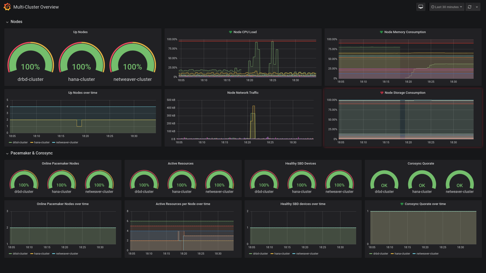

# Grafana dashboards

We provide two dashboards for Grafana, leveraging the exporter.

In addition to `ha_cluster_exporter`, these dashboards require Prometheus `node_exporter` to be configured on the target nodes.

They also assume that the target nodes in each cluster are grouped via the `job` label.

## Multi-Cluster overview

This dashboard gives an overview of multiple clusters monitored by the same Prometheus server.



## HA Cluster details

This dashboard shows the details of a single cluster.


## Installation

### RPM 

On openSUSE and SUSE Linux Enterprise distributions, you can install the package via zypper in your Grafana host:
```
zypper in grafana-ha-cluster-dashboards
systemctl restart grafana-server
```

For the latest development version, please refer to the [development upstream project in OBS](https://build.opensuse.org/project/show/network:ha-clustering:sap-deployments:devel). 

### Manual

Copy the [provider configuration file](provider-sleha.yaml) in `/etc/grafana/provisioning/dashboards` and then the JSON files inside `/var/lib/grafana/dashboards/sleha`.

Once done, restart the Grafana server.

### Grafana.com

Dashboards will be soon available on [grafana.com/dashboards](https://grafana.com/dashboards)

