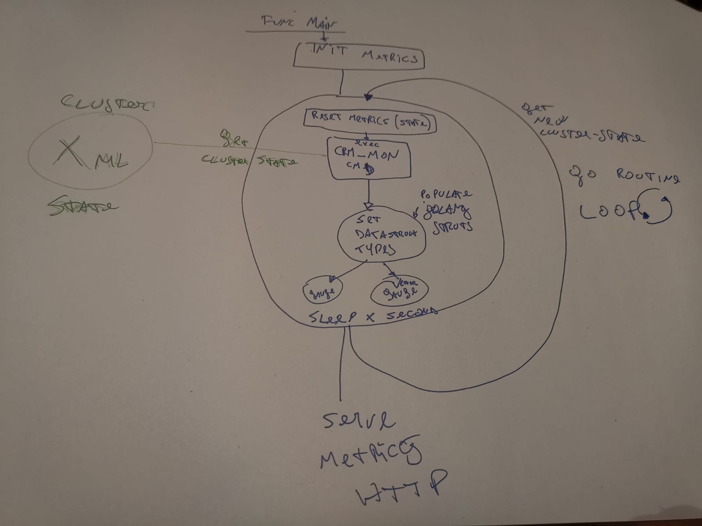

# Design:

THe global design of the exporter is following:

First in the `main` function we setup the Prometheus exporter metrics constructs. A metric hold a state. You can imagine them as global mutable variables which are served over http at the end.

The main functionality of the exporter is executed in a golang routine. Each golang routine retrieve data about some component(SBD, pacemaker, corosync) and they are indipendent each others.

On the layout of the project, when you add a new go routine aka a new metric/component, create a new file seperately from the exporter main.

Only the cluster metrics retrieved with crm_mon are contained in the `ha_cluster_exporter.go` since they are the principal metrics.

# A Detailed Example: (crm_mon)

Lets take an example:

 
 At the begin of the loop most of all metrics are "reset", so all the old information/state is removed. 
(this is done to clean up metrics who have complex labels)

The `cluster` state is retrieved by the  `crm_mon` command. Since the data is XML struct, the `crm_mon` is just a connector. Other commands could be used to get the state as "connector".

Once the data is retrieved, this the golang types are popoulated. 

Within this we set the various metrics (gauge, gaugeVec). 

THe loops sleep a X timeout . Finally the loop start to the begin again. 

The metric are served via http.

THe data/metrics retrivial is done in a gorutine async from the serving of metrics.
